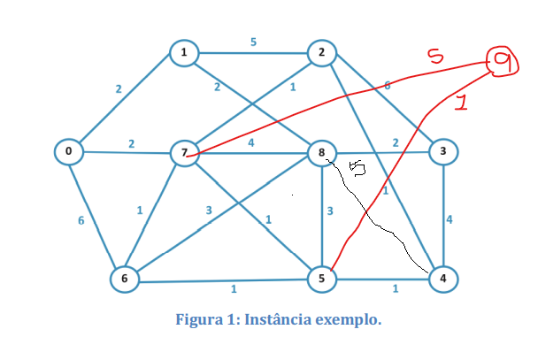
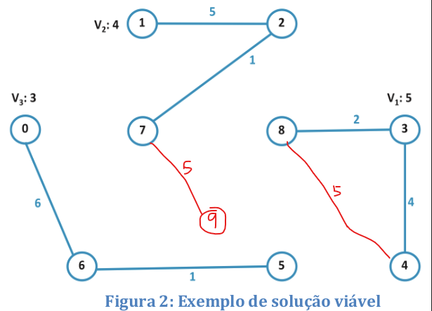

# Trabalho 1 - Inteligência Computacional 2022.1

O Problema da Clusterização Capacitada consiste na formação de agrupamentos com algumas
características específicas. Na definição do problema, considere um grafo G=(V, E) ponderado nos
vértices e nas arestas. O objetivo deste problema é particionar o conjunto de vértices V em p grupos
de tal forma que seja maximizada a soma dos benefícios das arestas internas dos grupos. Além disso,
com objetivo de deixar os grupos equilibrados, a soma dos pesos dos vértices de um mesmo grupo
é limitada inferior e superiormente por L e U.

Veja um exemplo de instância para este problema: Dado um conjunto com 9 pessoas que devem
ser divididas em 3 grupos. Para este exemplo considere as pessoas identificadas por números
inteiros de 0 a 8 (vértices do grafo abaixo). Considere também os pesos dos vértices w  $i =1$ para
$i \in \{0, 1, 4, 5, 6, 7, 8\}$, $w_2 =2$ e $w_3 =3$. No grafo abaixo, o valor associado às arestas indica o grau de
eficiência entre pares de pessoas.

Para formar grupos de maneira mais equilibrada, a soma dos pesos dos vértices de um mesmo
grupo deve ser maior ou igual a 3 e menor ou igual a 5 (L=3 e U=5). O problema é definir os 3 grupos de pessoas de forma a maximizar o grau de eficiência entre as pessoas de um mesmo grupo.

Uma possível solução viável para o problema á apresentada na Figura 2, onde foram definidos os
grupos: V 1 = {3, 4, 8}, V 2 = {1, 2, 7} e V 3 = {0, 5, 6}. Neste caso, as somas dos pesos dos nós de cada
grupo são 5, 4 e 3, respectivamente. Para esta solução, a soma do grau de eficiência das pessoas pertencentes a um mesmo grupo é dada por 2+4+5+1+6+1=19 unidades, que indica a qualidade da solução.

Nesta atividade deve ser implementada uma heurística (construtivo e busca local) capaz de gerar
boas soluções para um conjunto de instâncias disponibilizadas para este trabalho.

Nestes experimentos o tempo de execução deve ser limitado a 1 minuto. Para comparação
dos resultados, a heurística deve ser executada 10 vezes para cada uma das instâncias e deve-se
salvar o melhor resultado (custo e solução) e também o valor médio obtido, para cada uma das
instâncias. Estes resultados devem ser inseridos numa tabela a fim de termos uma comparação
entre as diferentes abordagens. Você pode atualizar a tabela quantas vezes quiser, ou seja, pode
postar assim que conseguir os primeiros resultados!